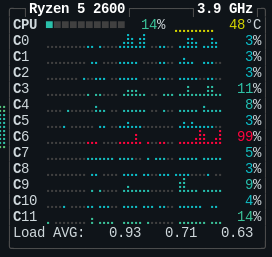
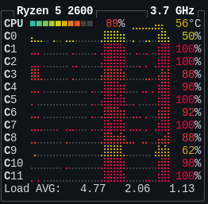

# A_Star
A_star algorithm designed to solve a python generated maze

## Where to begin
To begin, cd into src, this is the initial maze solving program. Run `sh solveMaze.sh`, this will compile the c++, build a new maze, then solve the maze.  
You can see how long it took to solve the maze and the path it took. You can run `./a_star.out` to see it solve the same maze again the time it takes to solve can vary.  
If you would like to test it with a smaller maze so it is easier to follow the path do this: (my program only works with odd sized mazes due to a border issue with rnd_maze)  

 - `python rnd_maze.py 5 5 > maze`  
 - Change line 7 and 8 of a_star.cpp to #define ROW 7 and #define COL 7 (must be 2 greater than the size of the maze)  
 - `g++ main.cpp`
 - `./a.out`

Output should look somethign like this:

> #######
> #o    #
> # # ###
> # #   #
> # # ###
> # #  x#
> #######
> The destination cell is found
> 
> The Path is -> (1,1) -> (1,2) -> (1,3) -> (2,3) -> (3,3) -> (4,3) -> (5,3) -> (5,4) -> (5,5) 
> A* took 69 microseconds without threading.  

## Multiprocessing and Threading
Move back a directory and cd into Threaded. Here I have made a script that will simultaneously build 10 mazes at once (it will slam your CPU, check out top while running).  Running `sh multiMaze.sh` will build the c++ program, create ten mazes, solve all ten mazes, both one at a time and then all at once with threading and compare the times. The path here will look strange and make no sense due to the threads solving simultaneously.  

If you would simply like to test out creating the ten mazes with the python script run `sh multiprocess.sh pythonCommands.txt`. This is kind of fun to see all of my cores go to nearly 100% utilization.  

**building maze without multiprocessing**
  

**building mazes with multiprocessing**
  
